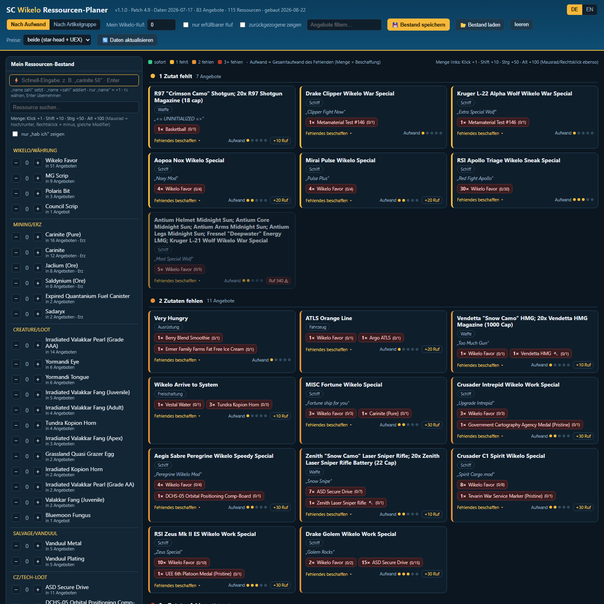

# StarCitizen-Wikelo-Planer

**Version 1.1.0** · 🇬🇧 English · [🇩🇪 Deutsch](README.de.md)

A resource planner for **Wikelo's Emporium** in *Star Citizen*: enter your resource stock and
instantly see **which Wikelo rewards you can get** — the ones available right now on top, the
rest **ranked by how much effort** the missing ingredients take.

**▶ Use online:** https://jaegerfeld.github.io/StarCitizen-Wikelo-Planer/
**▶ Use offline:** download [`SC_Wikelo_Planer.html`](SC_Wikelo_Planer.html) and open it (double-click).

The whole app is **one self-contained HTML file** — offline, no install, no server. The interface
is **bilingual (English/German)**, switchable in the header.

---

## Features

- **Enter your stock** — all ingredients on the left, grouped by sourcing (currency / mining /
  creature loot / contested zone / craftable …). Set amounts via **+/−**, **mouse wheel**,
  **right-click**, or **modifier click** (click +1 · Shift +10 · Ctrl +50 · Alt +100).
- **Quick entry** — command bar: `carinite 50` sets, `name +10` adds, with autocomplete.
- **Offers ranked by effort** — *Available now → 1 missing → 2 missing → 3+*. Or group by category.
- **Effort stars (1–5)** — amount-weighted: sum of *missing amount × sourcing cost per source*,
  log-scaled. "Wikelo Arrive" ≈ 1★, an Idris ≈ 5★.
- **"Get missing"** per offer — blueprint recipes for craftable ingredients, Wikelo Favor exchange
  paths, ore price hints.
- **Refresh data in-app** — reload offers (seeknd), blueprints (star-head) and ore prices (UEX)
  live in the browser; cached locally, offline build stays as fallback.
- **Reputation filter**, hide retired offers, **save/load stock** as `SC_Wikelo_Bestand.json`.

## Rebuild / update the bundled data

- **Windows:** double-click [`Wikelo_Planer_aktualisieren.bat`](Wikelo_Planer_aktualisieren.bat)
- **Linux/macOS:** `./Wikelo_Planer_aktualisieren.sh`
- **direct:** `python wikelo_planer_bauen.py`

Requires **Python 3.9+**, **no external packages** (standard library only). Produces
`SC_Wikelo_Planer.html` in the same folder. You can also just hit **Refresh data** inside the app.

## Data sources & credits

- **Wikelo offers:** community database *Wikelo's Emporium Reference*
  ([seeknd.github.io/Wikelo](https://seeknd.github.io/Wikelo/))
- **Blueprint recipes:** [star-head.de](https://star-head.de) (open API)
- **Ore prices:** [UEX](https://uexcorp.space) (open API)

Data is patch-dependent and rotates — verify in-game when in doubt.

## Experimental

[`experimental/ocr/`](experimental/ocr/) — groundwork for reading the inventory automatically via
OCR. Currently on hold because the SC inventory shows icons without names; details there.

## Disclaimer

Unofficial fan tool. Not affiliated with or endorsed by the Cloud Imperium Games Corporation.
Star Citizen® is a trademark of CIG. All data provided without warranty.

## AI note

> This project was created as an exploration of AI-driven software development.
> The code is overwhelmingly written with [Claude Code](https://claude.com/claude-code) (Anthropic).

## License

[BSD-3-Clause](LICENSE) · © 2026 Robert Seebauer
